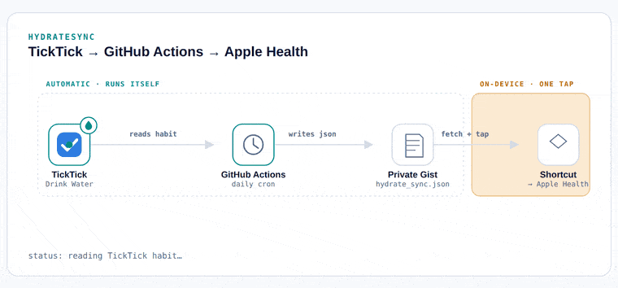
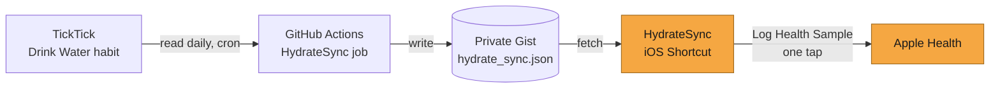

# HydrateSync

Mirrors a TickTick habit into Apple Health on a schedule, with no server to run and no app to keep open.

[](https://github.com/PremRavi28/HydrateSync-TickTick-AppleHealth/actions/workflows/hydrate-sync.yml)
[](https://github.com/PremRavi28/HydrateSync-TickTick-AppleHealth/actions/workflows/tests.yml)
[](https://github.com/PremRavi28/HydrateSync-TickTick-AppleHealth/actions/workflows/hydrate-sync.yml)
[](LICENSE)



## The problem

TickTick can track a water-intake habit. Apple Health can store water-intake
data. Neither talks to the other — TickTick's public API doesn't expose habit
data at all, and even if it did, Apple doesn't let any cloud service write to
HealthKit. Writes to Health only ever happen on-device, by an app the person
explicitly approved, in the moment. That's a deliberate privacy boundary, not
an oversight, and it means a fully server-side bridge between these two is
impossible by construction — for this project or anyone else's.

So the design here does the next best thing: automate everything that *can*
be automated, and isolate the one step that can't into a single, minimal,
on-device action.

## How it works



**Automatic, runs itself, costs nothing (`A → B → C`):** a GitHub Actions
workflow wakes up on a daily cron, logs into TickTick, reads however many
days of the water habit have changed since the last run, and writes the
result to a private Gist as JSON. No server to provision, no process to keep
alive — GitHub's own infrastructure runs it.

**On-device, one tap (`C → D → E`):** the HydrateSync iOS Shortcut fetches
that Gist and writes each day's total into Apple Health. This step can be
run any time — the same day, ten days later, next month — since the sync
always fills in whatever's missing rather than assuming daily use.

## Setup

1. **Secrets** — under Settings → Secrets and variables → Actions, add:
   `TICKTICK_USERNAME`, `TICKTICK_PASSWORD`, `GIST_ID`, `GIST_TOKEN`
   (a fine-grained PAT scoped to `gist` only — see [SECURITY.md](SECURITY.md)).
2. **Gist** — create a new *secret* Gist with one file, `hydrate_sync.json`,
   containing `{}`. Its ID goes in `GIST_ID` above.
3. **Enable the workflow** — Actions tab → "HydrateSync" →
   *Run workflow* to trigger it manually the first time.
4. **The Shortcut** — build the receiving HydrateSync Shortcut following
   [`shortcut/README.md`](shortcut/README.md).

## Project layout

```
hydrate_sync.py                      the whole sync job — read TickTick, merge, write Gist
test_hydrate_sync.py                 tests for the merge logic — no credentials needed to run
requirements.txt / requirements-dev.txt   pinned dependencies (dev adds pytest)
.github/workflows/hydrate-sync.yml   the scheduler + last-synced badge update
.github/workflows/tests.yml          runs the test suite on every push
shortcut/README.md                   the on-device half, step by step
assets/hydrate-sync-flow.gif         the diagram above
SECURITY.md                          what's stored where, and why
```

Run the tests locally with:

```
pip install -r requirements-dev.txt
python -m pytest -v
```

## Limitations, honestly

- Relies on an unofficial TickTick client, since habit data isn't part of
  TickTick's official public API. It authenticates like a normal login and
  could break if TickTick changes something server-side — see
  `fetch_hydration_log()` in `hydrate_sync.py` for where that surface lives.
- Health writes are not deduplicated automatically; running the Shortcut
  twice for the same day will double-count unless you add a lookup step
  (noted in `shortcut/README.md`).

## License

MIT — see [LICENSE](LICENSE).

Author: **Prem Ravi**
